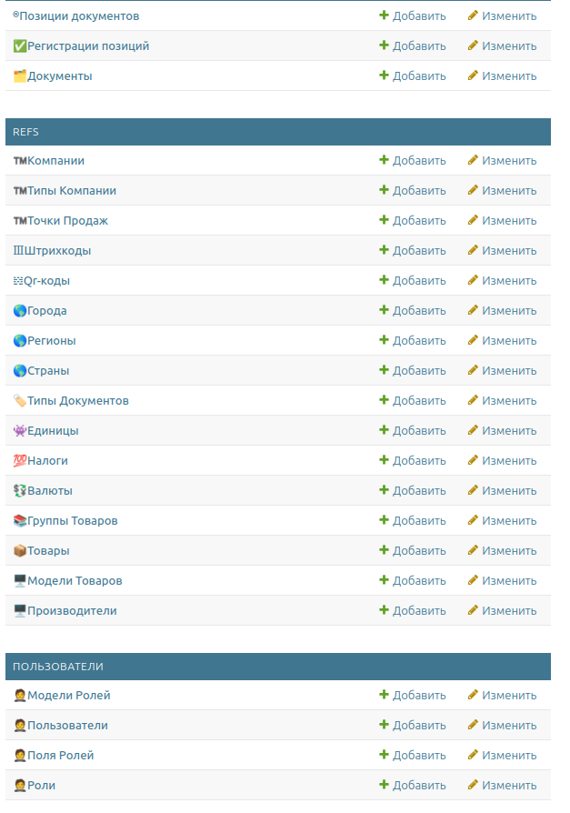

# production
[](https://github.com/usermicrodevices/prod/blob/main/LICENSE)
django shop


# installation
```
git clone git@github.com:usermicrodevices/prod.git
cd prod
mkdir logs media static
python -m venv venv
. ./venv/bin/activate
pip install -r requirements.txt
./manage.py collectstatic
./manage.py makemigrations
./manage.py migrate
./manage.py createsuperuser
```

# running
```
./manage.py runserver --noasgi
```
and go to your browser http://127.0.0.1:8000/admin

# run with daphne
```
daphne -e ssl:interface=127.0.0.1:9443:privateKey=ssl-cert-snakeoil.key:certKey=ssl-cert-snakeoil.pem shop.asgi:application
```
and go to your browser https://127.0.0.1:9443/admin
